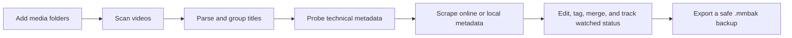
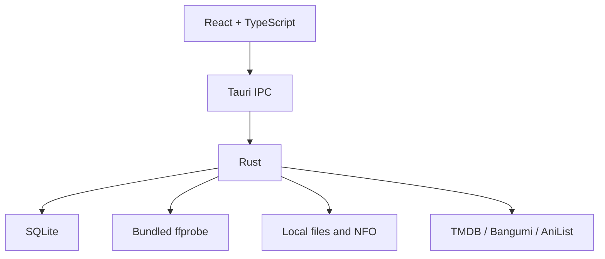

<div align="center">
  
  <h1>MediaManager</h1>
  <p><strong>A local movie, TV series, and anime library for Windows</strong></p>
  <p>Scan local media, organize non-standard anime filenames, fetch metadata, and keep the complete library on your own computer.</p>

  [简体中文](README.md) · [Download](../../releases/latest) · [Release Notes](RELEASE.en.md) · [Publishing Guide](PUBLISHING.en.md)

  
  
  
  
  
</div>

> MediaManager does not move or modify original video files. Metadata, watched status, tags, collections, blacklist entries, and poster caches remain on the local computer.

## Screenshots

Screenshot slots are prepared under [docs/screenshots](docs/screenshots/README.md). The final gallery will include:

- Library overview
- Media details
- Chinese anime scraping with Bangumi and AniList
- Batch management
- Backup and restore
- Logs and diagnostics

## Why MediaManager

Anime release filenames often look like:

```text
[Nekomoe kissaten][LAZARUS][01][1080p][JPTC].mp4
[Nekomoe kissaten][LAZARUS][02][1080p][JPTC].mp4
```

MediaManager identifies the release group, title, episode number, resolution, and language markers, then groups both files under one `LAZARUS` poster instead of treating them as unrelated short videos.

## Downloads

Regular users do not need Node.js, Rust, pnpm, Visual Studio, or FFmpeg.

| Download | Recommended for | Usage |
| --- | --- | --- |
| `MediaManager_0.1.0_x64-setup.exe` | Most users | Install once and launch from the Windows Start menu |
| `MediaManager_0.1.0_windows_x64_portable.zip` | Portable usage | Extract the complete archive and run `media-manager.exe` |
| GitHub Source code ZIP | Developers | Requires the complete development toolchain |

## Features

### Scanning And Media Detection

- Multiple recursive scan folders.
- Incremental library updates.
- Live progress, cancellation, ignored-file count, and error history.
- Missing-file detection.
- Bundled `ffprobe` for duration, resolution, codecs, container format, HDR10, and HLG.

### Filename Parsing And Grouping

- Movie title and year parsing.
- `S01E02`, `1x02`, `EP02`, numeric, and Chinese episode formats.
- Release-group bracket anime naming.
- Episode revisions such as `v2`.
- Parent-folder and title-based series grouping.
- Manual movie, series, anime, and other categories that remain locked across scans.

### Metadata And Posters

| Media | Provider | Data |
| --- | --- | --- |
| Movies and live-action TV | TMDB | Chinese titles, original titles, dates, overviews, ratings, posters |
| Anime | Bangumi | Chinese search, titles, overviews, ratings, dates, covers |
| Anime supplement | AniList | English, romaji, native titles, ratings, artwork |
| Offline metadata | Local NFO | UTF-8 and UTF-16 metadata and local posters |

- Manual candidate selection.
- Batch metadata refresh.
- Local poster caching.
- Editable title, year, category, overview, and notes.
- Safe handling of invalid plain-text `.nfo` files.

### Library Management

- Poster grid for movies, series, and anime.
- Search by title, filename, and tag.
- Sorting and watched-status filtering.
- Watched and unwatched badges on posters.
- Tags and custom collections.
- Batch selection, deletion, metadata refresh, and grouping.
- Duplicate organization.
- Reveal original files in Windows Explorer.

### Blacklist

- Removing an item does not delete its original video.
- Removed paths are blacklisted and skipped by future scans.
- Restore individual or all blacklisted files.
- Case-insensitive Windows path matching.

### Data Safety

- Self-contained `.mmbak` backups.
- SQLite database and cached poster inclusion.
- TMDB token forcibly excluded from every manual and automatic backup.
- Restore keeps only the token already configured on the current computer.
- Backup format, schema, and integrity checks before restore.
- Automatic pre-restore backup.
- Media root migration after drive-letter or folder changes.

### Diagnostics

- Database version, size, and item counts.
- Bundled `ffprobe` health check.
- Failed scans and missing-file statistics.
- Recent application logs.
- Detailed scan history.

## Workflow



## Data Storage

```text
%LOCALAPPDATA%\com.local.mediamanager\
├── library.db
├── backups\
└── cache\posters\
```

Normal upgrades and uninstallation do not remove this directory. Original videos remain in the user's media folders.
The TMDB token is stored only in the local `library.db`. It is never included in source code, installers, or backups.

## Credential Safety

- Never place a TMDB token in source files, documentation, issues, logs, or screenshots.
- `.env` files, databases, backups, and the private `记忆` directory are ignored by Git.
- Run `pnpm.cmd check:secrets` before committing; GitHub Actions performs the same scan.
- Every user configures their own token locally. A repository or Release never needs one.

## Architecture



## Development

Requirements:

- Windows 10/11 x64
- Node.js and pnpm
- Rust MSVC toolchain
- Visual Studio Build Tools with Desktop development with C++

Run:

```powershell
pnpm.cmd install
powershell -ExecutionPolicy Bypass -File .\scripts\prepare-ffprobe.ps1
pnpm.cmd tauri dev
```

Build the NSIS installer:

```powershell
pnpm.cmd tauri build
```

`ffprobe.exe` exceeds GitHub's 100 MB per-file limit and is not committed. The preparation script downloads a pinned BtbN LGPL build and verifies its SHA-256.

## Technology

- Tauri 2
- React 19
- TypeScript and Vite
- Rust
- SQLite / rusqlite
- NSIS

## Publishing

- [Release Notes](RELEASE.en.md)
- [Beginner GitHub Publishing Guide](PUBLISHING.en.md)
- [Chinese README](README.md)

## License

A project license has not been selected yet. Add an appropriate license, such as MIT or Apache-2.0, before publishing the repository as open source.

FFmpeg/ffprobe is distributed under its separate LGPL license under `src-tauri/third-party/ffmpeg/`.

## Acknowledgements

[Tauri](https://tauri.app/) · [React](https://react.dev/) · [SQLite](https://www.sqlite.org/) · [TMDB](https://www.themoviedb.org/) · [Bangumi](https://bangumi.tv/) · [AniList](https://anilist.co/) · [FFmpeg](https://ffmpeg.org/) · [BtbN FFmpeg Builds](https://github.com/BtbN/FFmpeg-Builds)
