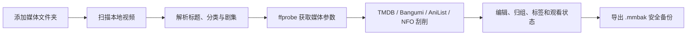
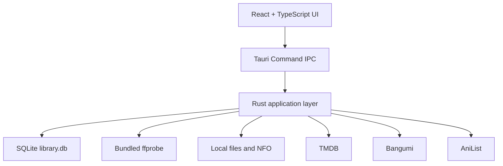

<div align="center">
  
  <h1>MediaManager</h1>
  <p><strong>面向 Windows 的本地电影、剧集与动画资料库</strong></p>
  <p>扫描本地视频、整理非标准动画命名、获取中文元数据，并将所有资料安全地保存在自己的电脑上。</p>

  [English](README.en.md) · [下载最新版本](../../releases/latest) · [发布说明](RELEASE.zh-CN.md) · [GitHub 发布教程](PUBLISHING.zh-CN.md)

  
  
  
  
  
</div>

> MediaManager 不会移动或修改原始视频文件。影片资料、观看状态、标签、片单、黑名单和海报缓存全部保存在本机。TMDB Token 不会写入源码、安装包或备份。

## 界面预览

真实截图位已经准备好。请按照 [截图指南](docs/screenshots/README.md) 提供图片，之后将显示为：

| 资料库主页 | 影片详情与在线刮削 |
| --- | --- |
| `docs/screenshots/library-overview.png` | `docs/screenshots/media-detail.png` |

| 动画中文元数据 | 数据备份与恢复 |
| --- | --- |
| `docs/screenshots/anime-scraping.png` | `docs/screenshots/data-safety.png` |

## 为什么做这个项目

许多媒体管理软件对规范命名支持很好，但字幕组动画文件经常被拆成大量无关短片，例如：

```text
[Nekomoe kissaten][LAZARUS][01][1080p][JPTC].mp4
[Nekomoe kissaten][LAZARUS][02][1080p][JPTC].mp4
```

MediaManager 会识别字幕组、作品名、集数、分辨率和语言标记，并将这些文件归入同一个 `LAZARUS` 条目，而不是生成多个独立影片。

## 下载方式

普通用户不需要下载源码，也不需要安装 Node.js、Rust、pnpm 或 FFmpeg。

| 文件 | 适合谁 | 使用方式 |
| --- | --- | --- |
| `MediaManager_0.1.0_x64-setup.exe` | 推荐给绝大多数用户 | 安装一次，以后从 Windows 开始菜单打开 |
| `MediaManager_0.1.0_windows_x64_portable.zip` | 不想安装或使用移动硬盘的用户 | 完整解压后双击 `media-manager.exe` |
| GitHub 自动生成的 Source code ZIP | 开发者 | 这是源码，不能直接双击运行，需要完整开发环境 |

请从仓库右侧的 **Releases** 下载安装版或便携版。

### 安装版

1. 下载 `MediaManager_0.1.0_x64-setup.exe`。
2. 双击安装。
3. 按 Windows 键，搜索 `MediaManager`。
4. 按回车打开，也可以固定到任务栏。

### 便携版 ZIP

1. 下载 `MediaManager_0.1.0_windows_x64_portable.zip`。
2. 完整解压到一个可写目录。
3. 双击 `media-manager.exe`。
4. 不要单独移动 EXE，旁边的 `binaries` 和 `third-party` 目录必须保留。

便携版不会创建开始菜单快捷方式，但资料仍保存在 `%LOCALAPPDATA%\com.local.mediamanager\`。

## 功能总览

### 资料库扫描

- 添加一个或多个媒体文件夹。
- 递归扫描常见视频格式。
- 增量更新已有资料库。
- 显示扫描进度、当前文件、错误和忽略数量。
- 支持取消正在进行的扫描。
- 标记磁盘中已经缺失的文件。
- 使用内置 `ffprobe` 获取：
  - 视频时长
  - 分辨率
  - 视频与音频编码
  - 容器格式
  - HDR10 与 HLG 信息

### 文件名识别与归组

- 识别普通电影标题及年份。
- 识别 `S01E02`、`1x02`、`EP02`、中文“第 2 集”等剧集格式。
- 识别字幕组方括号动画命名。
- 支持纯数字集数、修正版 `v2`、季数及集数。
- 按父文件夹和作品名称归并动画或剧集。
- 支持手动修改电影、剧集、动画和其他分类。
- 人工分类不会被后续扫描覆盖。

### 元数据与海报

| 类型 | 数据来源 | 内容 |
| --- | --- | --- |
| 电影与真人剧集 | TMDB | 中文标题、原名、年份、简介、评分、海报 |
| 动画 | Bangumi | 中文搜索、中文标题、中文简介、评分、年份、封面 |
| 动画补充 | AniList | 英文名、罗马字、日文原名、评分和海报 |
| 离线资料 | 本地 NFO | UTF-8、UTF-16 电影、剧集和动画资料及同目录海报 |

- 手动搜索并选择候选结果。
- 一键刷新所有选中条目的匹配元数据。
- 本地海报与在线海报都会缓存到应用目录。
- 支持编辑标题、年份、简介和用户备注。
- 无效或纯文本 `.nfo` 会被安全跳过。

### 资料库管理

- 海报墙展示电影、剧集和动画。
- 实时搜索标题、文件名和标签。
- 按最近添加、标题、年份和观看状态排序。
- 筛选全部、未看或已看。
- 海报直接显示已看/未看状态。
- 创建自定义标签和片单。
- 批量选择、批量删除和批量刷新资料。
- 手动将多个文件合并到一个海报。
- 自动整理高置信度重复条目。
- 在资源管理器中定位原始文件。

### 删除黑名单

- 从资料库删除条目时不删除原始视频。
- 被删除文件会进入黑名单。
- 后续扫描自动忽略黑名单路径。
- 可以恢复单个或全部黑名单文件并重新扫描。
- Windows 路径匹配不区分大小写。

### 数据安全

- 导出单个 `.mmbak` 自包含备份。
- 备份包含 SQLite 资料库和本地海报。
- 所有手动和自动备份都强制排除 TMDB Token。
- 恢复备份时仅保留当前电脑已有 Token，不接受备份中的凭据。
- 恢复前检查备份格式、数据库版本和完整性。
- 恢复前自动备份当前资料库。
- 更换硬盘或盘符后批量迁移媒体根路径。
- 同步更新扫描目录、媒体文件和黑名单路径。

### 日志与诊断

- 查看数据库版本、大小和文件数量。
- 检查内置 `ffprobe` 是否可用。
- 查看失败扫描和缺失文件统计。
- 阅读最近 500 行应用日志。
- 扫描历史记录包括新增、更新、缺失、忽略和错误。

## 使用流程



## 数据保存位置

```text
%LOCALAPPDATA%\com.local.mediamanager\
├── library.db
├── backups\
└── cache\posters\
```

- 升级、覆盖安装和正常卸载不会主动删除资料库。
- 重新安装后会继续读取相同数据。
- 原始视频始终保留在用户选择的媒体目录。
- 发布后应保持应用标识 `com.local.mediamanager` 不变。
- TMDB Token 只保存在本机 `library.db` 中；换电脑恢复备份后需要重新填写。

## 凭据安全

- 不要把 TMDB Token 写进源码、README、Issue、日志或截图。
- `.env`、数据库、备份和私人 `记忆` 目录已加入 `.gitignore`。
- 提交前运行 `pnpm.cmd check:secrets`，项目也会在 GitHub Actions 中自动扫描疑似密钥。
- 每位用户应在自己的应用中配置自己的 Token，GitHub 仓库和 Release 不需要 Token。

## 技术架构



| 模块 | 技术 |
| --- | --- |
| 桌面外壳 | Tauri 2 |
| 前端 | React 19、TypeScript、Vite |
| 后端 | Rust |
| 本地数据库 | SQLite / rusqlite |
| 媒体探测 | 内置 LGPL 静态 ffprobe |
| Windows 安装器 | NSIS |

## 从源码运行

### 环境要求

- Windows 10/11 x64
- Node.js
- pnpm
- Rust MSVC 工具链
- Visual Studio Build Tools，并安装 Desktop development with C++

### 准备与运行

```powershell
pnpm.cmd install
powershell -ExecutionPolicy Bypass -File .\scripts\prepare-ffprobe.ps1
pnpm.cmd tauri dev
```

### 构建安装包

```powershell
pnpm.cmd tauri build
```

安装包生成于：

```text
src-tauri\target\release\bundle\nsis\
```

`ffprobe.exe` 超过 GitHub 单文件 100 MB 限制，因此不提交到源码仓库。准备脚本会从固定的 BtbN GitHub Release Asset 下载并校验 SHA-256。

## 项目结构

```text
MediaManager/
├── src/                       React 前端
├── src-tauri/
│   ├── src/                   Rust 后端
│   ├── migrations/            SQLite Schema migrations
│   ├── icons/                 应用图标
│   └── third-party/ffmpeg/    ffprobe 许可证与来源
├── scripts/                   构建准备脚本
├── docs/screenshots/          GitHub 项目截图
└── 记忆/                       开发记录与项目进度
```

## 发布与校验

- [中文发布说明](RELEASE.zh-CN.md)
- [从零开始的 GitHub 发布教程](PUBLISHING.zh-CN.md)
- [English README](README.en.md)

当前安装包尚未进行商业代码签名，因此 Windows SmartScreen 可能显示“未知发布者”。请从本仓库 Release 下载并核对 SHA-256。

## 开源许可

项目目前尚未选择开源许可证。公开发布源码前应添加项目许可证，例如 MIT 或 Apache-2.0。没有许可证时，其他人可以查看代码，但默认没有复制、修改和重新分发的授权。

FFmpeg/ffprobe 使用单独的 LGPL 许可证，相关文件位于 `src-tauri/third-party/ffmpeg/`。

## 致谢

- [Tauri](https://tauri.app/)
- [React](https://react.dev/)
- [SQLite](https://www.sqlite.org/)
- [TMDB](https://www.themoviedb.org/)
- [Bangumi](https://bangumi.tv/)
- [AniList](https://anilist.co/)
- [FFmpeg](https://ffmpeg.org/)
- [BtbN FFmpeg Builds](https://github.com/BtbN/FFmpeg-Builds)
